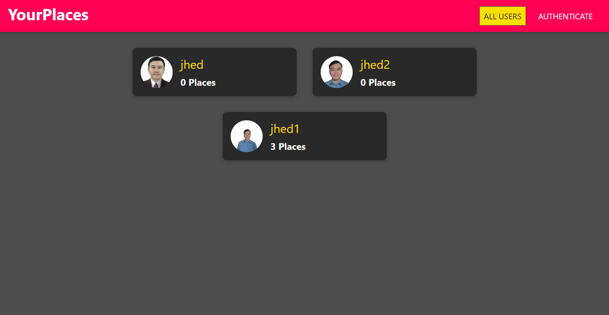
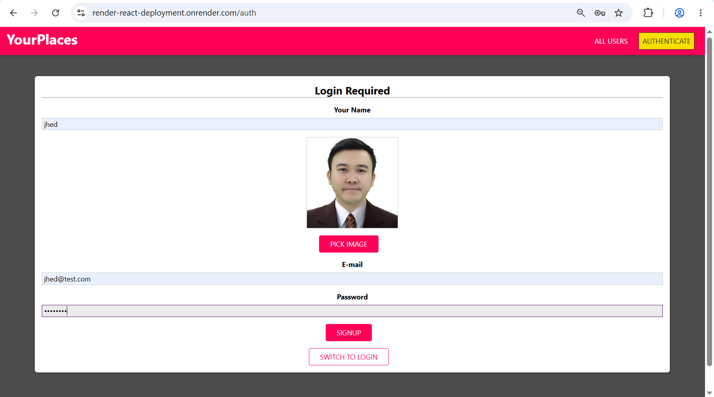
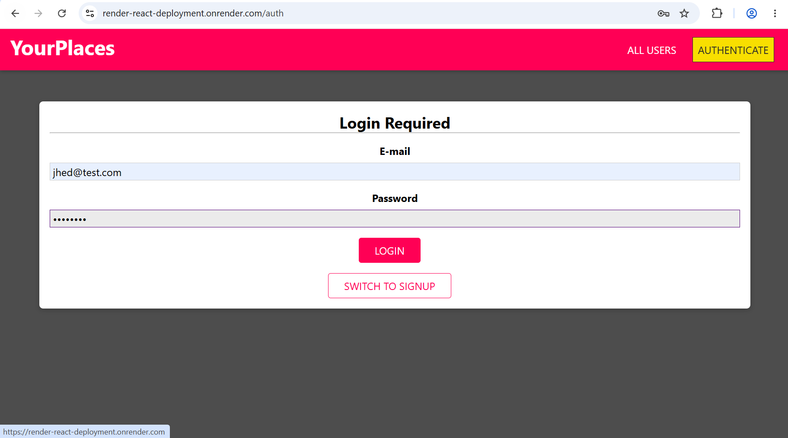
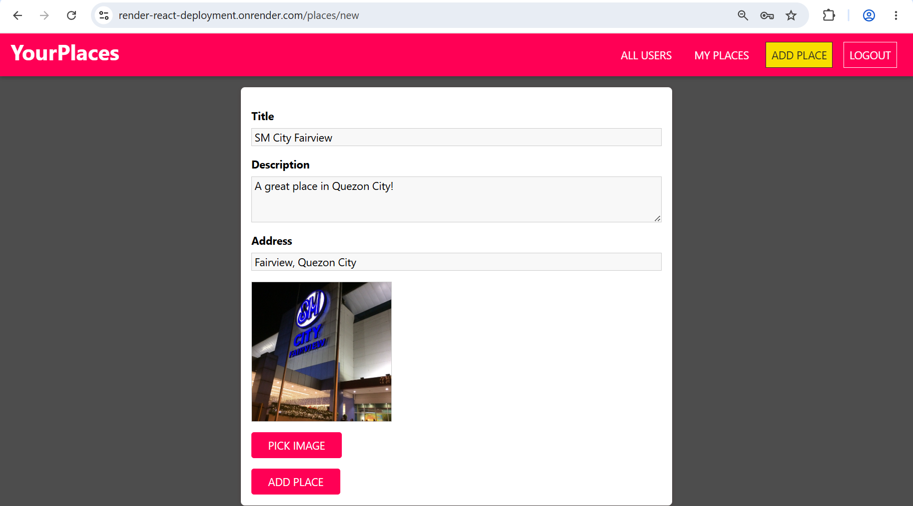
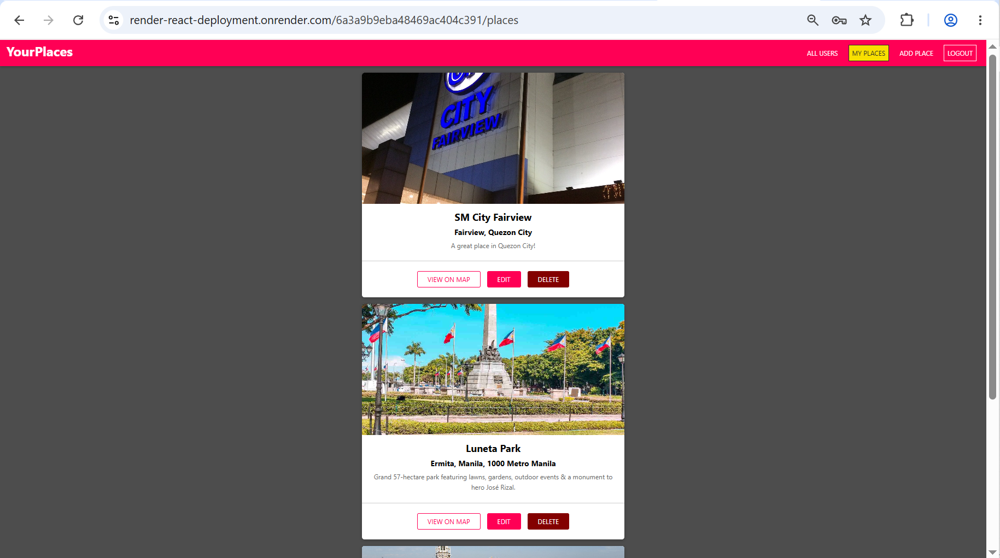
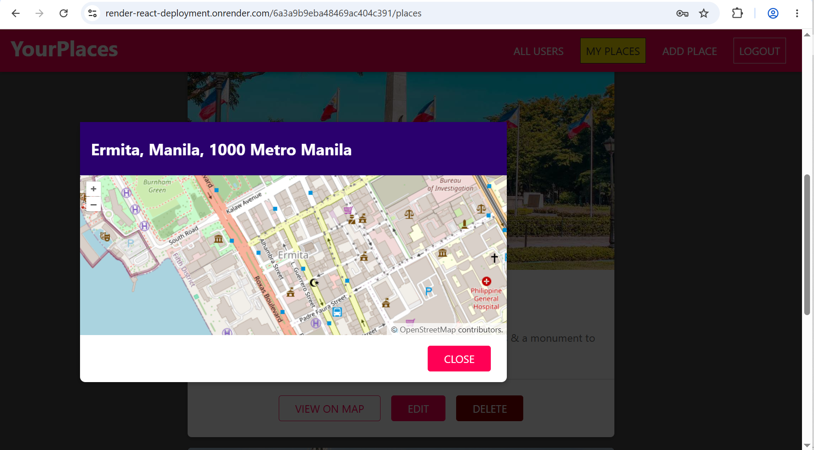
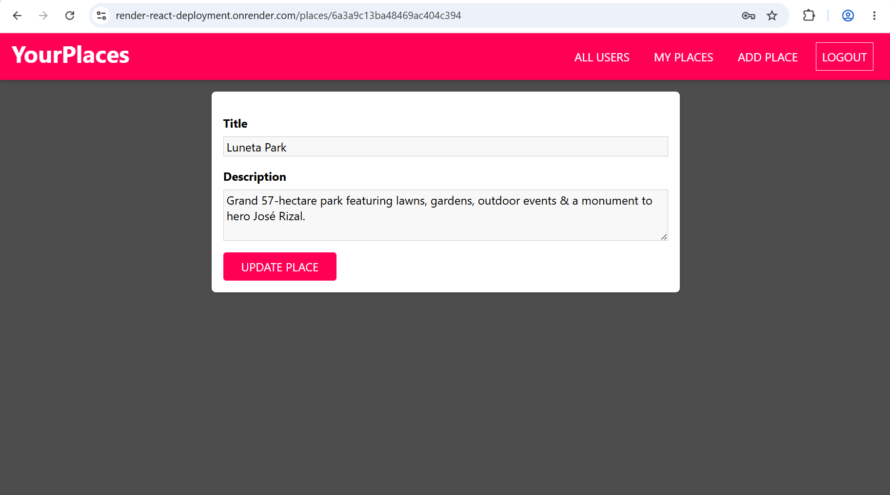
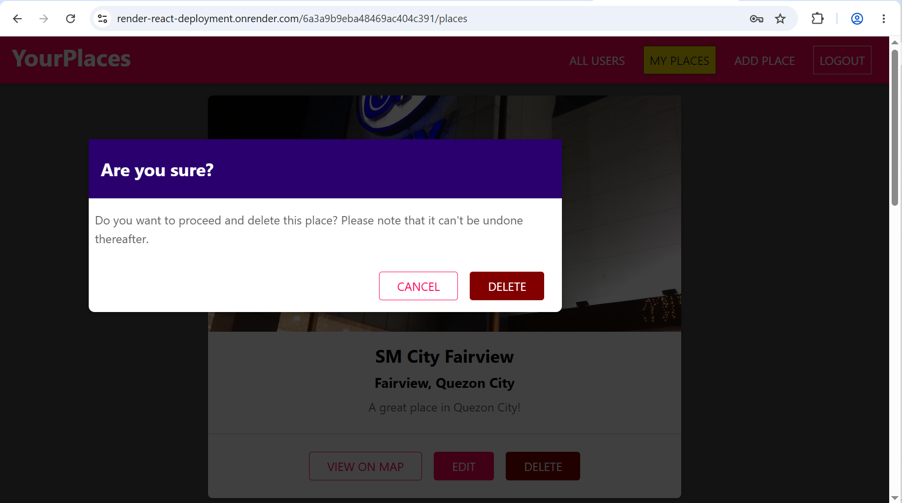

# Project Title

YourPlaces – MERN Location Sharing Web Application (Microservice)

It is a React web application where users can share places (with images & location) with other users.

---

## 🚀 Live Demo

Check out the live deployment of the application here:
https://render-reactdeployment.onrender.com/

---

## ✨ Features

- **Responsive Design** - Fully optimized for mobile, tablet, and desktop views.
- **State Management** - Handled locally via React Hooks.
- **Component-Driven Architecture** - Highly reusable, modular UI components.
- **Modern Tooling** - Fast build times and hot-reloading.

---

## 🛠️ Tech Stack

- **Frontend:** React.js, JavaScript (ES6+), JSX
- **Styling:** CSS
- **Routing:** React Router DOM (v5)
- **Build Tool:** Created without CLI Build Tool using Webpack.

---

## 📦 Getting Started

Follow these simple steps to get a local copy of the project up and running.

### Prerequisites

Make sure you have Node.js installed on your machine.

- [Download Node.js](https://nodejs.org)

### Installation

1. Clone the repository:

   ```bash
   git clone https://github.com/arnoldjhedsapigao-spec/render-react-deployment.git
   ```

2. Navigate into the project directory:

   ```bash
   cd your-repo-name
   ```

3. Install the dependencies:
   ```bash
   npm install
   ```

---

## 💻 Available Scripts

In the project directory, you can run the following commands:

### `npm start`

Runs the app in the development mode.
Opens http://localhost:3000 to view it in your browser. The page will reload automatically when you make changes.

### `npm run build`

Builds the app for production to the `dist` folder.
It correctly bundles React in production mode and optimizes the build for the best performance.

---

### Environment Variables

Create a `.env` file in the root directory and add the following:

```env
REACT_APP_BACKEND_URL=http://localhost:5000/api
REACT_APP_ASSET_URL=http://localhost:5000
```

---

## Screenshots

### Home Page










---

## 📂 Project Structure

```text
├── public/             # Static assets (css, js, html)
├── src/
│   ├── assets/          # Global images
│   ├── place/         # Page routes (Place)
│   │   ├── components/         # Place UI components
│   │   ├── pages/         # Page views (Place)
│   ├── shared/         # Reusable materials
│   │   ├── components/         # Reusable UI components
│   │   │   ├── FormElements/         #  (Buttons, ImageUpload, Input)
│   │   │   ├── Navigation/         # (MainNavigation, NavLinks, SideDrawer)
│   │   │   ├── UIElements/         # (Avatar, Backdrop, Card, ErrorModal, LoadingSpinner, MapOL, Modal)
│   │   ├── context/         # Context (authorization and authentication)
│   │   ├── hooks/         # Custom React Hooks
│   │   ├── util/         # Utility (validators)
│   ├── user/         # Page routes (User)
│   │   ├── components/         # User UI components
│   │   ├── pages/         # Page views (User)
│   ├── App.js             # Root component
│   ├── index.css             # global stylesheets
│   ├── index.js             # Application entry point
├── .babelrc          # Tells Babel to transform JSX and modern JavaScript syntax
├── .env          # Local environment variables (ignored by Git)
├── .env.production          # Production environment variables (ignored by Git)
├── .gitignore          # Files and folders to ignore in Git (dist, .env, .env.production)
├── package.json        # Project metadata and dependencies
└── README.md           # Project documentation
└── webpack.config.js           # Webpack configuration
```

---

## 🤝 Contributing

Contributions make the open-source community an amazing place to learn, inspire, and create. Any contributions you make are **greatly appreciated**.

1. Fork the Project
2. Create your Feature Branch (`git checkout -b feature/AmazingFeature`)
3. Commit your Changes (`git commit -m 'Add some AmazingFeature'`)
4. Push to the Branch (`git push origin feature/AmazingFeature`)
5. Open a Pull Request

---

## ✉️ Contact

Arnold Jhed Sapigao - https://www.linkedin.com/in/arnold-jhed-s-25855784/

Project Link: https://github.com/arnoldjhedsapigao-spec/render-react-deployment
